# DANH SÁCH LIÊN KẾT (LINKED LISTS)

- Danh sách liên kết đơn (Single Linked List)
- Danh sách liên kết đôi (Double Linked List)
- Danh sách liên kết vòng (Circular Linked List)

------------

1. Kiểu dữ liệu tĩnh
Khái niệm: Một số đối tượng dữ liệu không thay thay đổi được kích thước, cấu trúc, … trong suốt quá trình sống. Các đối tượng dữ liệu này thuộc những kiểu dữ liệu tĩnh. 
Một số kiểu dữ liệu tĩnh: các cấu trúc dữ liệu được xây dựng từ các kiểu cơ sở như: kiểu thực, kiểu nguyên, kiểu ký tự … hoặc từ các cấu trúc đơn giản như cấu trúc, tập hợp, mảng.
> Các đối tượng dữ liệu thuộc kiểu dữ liệu tĩnh thường cứng ngắt, gò bó, khó diễn tả được thực tế vốn  sinh động, phong phú.

 Hạn chế của CTDL tĩnh
Một số đối tượng dữ liệu có thể thay đổi về cấu trúc, độ lớn… chẳng hạn danh sách các học viên trong một lớp học có thể tăng thêm, giảm đi...
<br>Nếu dùng những cấu trúc dữ liệu tĩnh đã biết như mảng để biểu diễn thì:
- Những thao tác phức tạp, kém tự nhiên
- Chương trình khó đọc, khó bảo trì
- Sử dụng bộ nhớ không hiệu quả( do dữ liệu tĩnh sẽ chiếm vùng nhớ đã dành cho chúng suốt quá trình hoạt động của chương trình )

<br>Cấu trúc dữ liệu tĩnh: Ví dụ: Mảng 1 chiều
- Kích thước cố định (fixed size)
- Chèn 1 phần tử vào mảng rất khó
- Các phần tử tuần tự theo chỉ số 0 đến n-1
- Truy cập ngẫu nhiên (random access)
[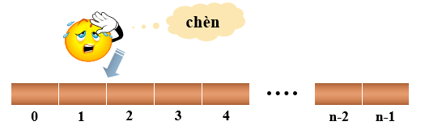](# "Thao tác trên mảng")

**Hướng giải quyết**
Cần xây dựng cấu trúc dữ liệu đáp ứng được các yêu cầu:
- Linh động hơn
- Có thể thay đổi kích thước, cấu trúc trong suốt thời gian sống
**->Cấu trúc dữ liệu động**

Cấu trúc dữ liệu động:
Ví dụ: Danh sách liên kết, cây
- Cấp phát động lúc chạy chương trình
- Các phần tử nằm rải rác ở nhiều nơi trong bộ nhớ
- Kích thước danh sách chỉ bị giới hạn do RAM
- Thao tác thêm xoá đơn giản

Tạo ra một biến động và cho con trỏ p chỉ đến nó:
```cpp
void* malloc(n*sizeof(kiểu_dữ_liệu));
```
// trả về con trỏ chỉ đến vùng nhớ size byte vừa được cấp phát.
```cpp
void* calloc(n, sizeof(kiểu_dữ_liệu));
```
// trả về con trỏ chỉ đến  vùng nhớ  vừa được cấp phát gồm n phần tử,
 // mỗi phần tử có kích thước size byte
```cpp
new kiểu_dữ_liệu[n]; // toán tử cấp phát bộ nhớ trong C++
```
Hàm free(p) huỷ vùng nhớ cấp phát bởi hàm malloc hoặc calloc do p trỏ tới
Toán tử delete[ ] p huỷ vùng nhớ cấp phát bởi toán tử new do p trỏ tới

**Danh sách liên kết:**
- Mỗi phần tử của danh sách gọi là node (nút)
- Mỗi node có 2 thành phần: phần dữ liệu và phần liên kết chứa địa chỉ của node kế tiếp hay node trước nó
- Các thao tác cơ bản trên danh sách liên kết:
Thêm một phần tử mới
Xóa một phần tử
Tìm kiếm
…
- Danh sách liên kết đơn: mỗi phần tử liên kết với phần tử đứng sau nó trong danh sách:
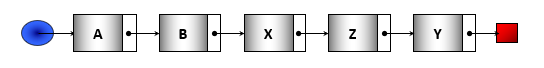
- Danh sách liên kết đôi: mỗi phần tử liên kết với các phần tử đứng trước và sau nó trong danh sách:
[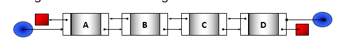](# "Danh sách liên kết đôi")
- Danh sách liên kết vòng : phần tử cuối danh sách liên kết với phần tử đầu danh sách:
[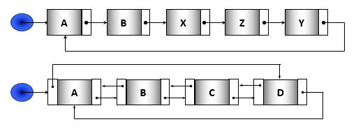](# "Danh sách liên kết vòng")
# Danh sách liên kết đơn (DSLK đơn)
Là danh sách các node mà mỗi node có 2 thành phần:
- Thành phần dữ liệu: lưu trữ các thông tin về bản thân phần tử
- Thành phần mối liên kết: lưu trữ  địa chỉ của phần tử kế tiếp trong danh sách, hoặc lưu trữ giá trị NULL nếu là phần tử cuối danh sách
Khai báo node
```cpp
struct  Node {
		DataType data; // DataType là kiểu đã định nghĩa trước
		Node *pNext;   // con trỏ chỉ đến cấu trúc Node
};
```
Cấu trúc 1 node
[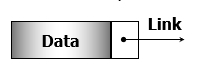](# "Cấu trúc node")

Ví dụ 1: Khai báo node lưu số nguyên:
```cpp
struct  Node {
		int data;
		Node *pNext; 
};
```
Ví dụ 2: Định nghĩa một phần tử trong danh sách đơn lưu trữ hồ sơ sinh viên:
```cpp
struct SinhVien {
		char Ten[30];
		int MaSV;
};
struct SVNode {
		SinhVien data;
		SVNode *pNext;
};
```
Tổ chức, quản lý:
Để quản lý một DSLK đơn chỉ cần biết địa chỉ phần tử đầu danh sách
Con trỏ pHead sẽ được dùng để lưu trữ địa chỉ phần tử đầu danh sách. Ta có khai báo:
```cpp
Node *pHead;
```
Để tiện lợi, có thể sử dụng thêm  một con trỏ pTail giữ địa chỉ phần tử cuối danh sách. Khai báo pTail như sau: 
```cpp
Node *pTail;
```
[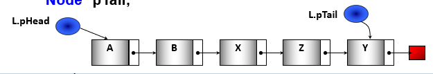](# "Quản lí danh sách liên kết")

Ví dụ: Khai báo cấu trúc 1 DSLK đơn chứa số nguyên
// kiểu của một phần tử trong danh sách
```cpp
struct Node {
	int data;
	Node* pNext;
};
// kiểu danh sách liên kết
struct List {
	Node* pHead;
	Node* pTail;
};
//Khai báo biến kiểu danh sách:
	List  tên_biến; //Danh sách của node

```
Tạo một node mới: Viết hàm getNode 
```cpp
Node* getNode ( DataType  x) {
	Node *p;
	p = new Node;  // Cấp phát vùng nhớ cho node
	if  (p==NULL) {
		cout<<“Khong du bo nho!”;  return NULL; 
	}
	p->data = x; 	// Gán dữ liệu cho phần tử p
	p->pNext = NULL;
	return p;
}
```
Để tạo một phần tử mới cho danh sách, cần thực hiện câu lệnh: 
```cpp
Node *new_ele = GetNode(x);
```
new_ele sẽ quản lý địa chỉ của phần tử mới được tạo.

Các thao tác cơ bản trên danh sách liên kết:
- Tạo danh sách rỗng
- Thêm một phần tử vào danh sách
- Duyệt danh sách
- Tìm kiếm một giá trị trên danh sách
- Xóa một phần tử ra khỏi danh sách
- Hủy toàn bộ danh sách
- …

Tạo danh sách rỗng
[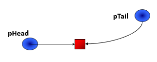](# "Tạo danh sách rỗng")
```cpp
void Init(List &L) {
	L.pHead = L.pTail = NULL;
}

```

Thêm một phần tử vào danh sách: Có 3 vị trí thêm
- Gắn vào đầu danh sách
- Gắn vào cuối danh sách 
- Chèn vào sau nút q trong danh sách
**Chú ý trường hợp danh sách ban đầu rỗng**
<br>**Thêm một phần tử**
Nếu danh sách (L) ban đầu **rỗng**
[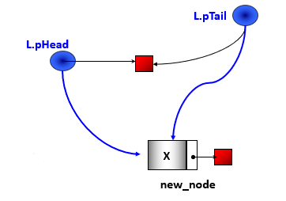](# "Thêm phần tử khi danh sách ban đầu rỗng")
```cpp
L.pHead = L.pTail = new_node;
```
<br>**Thêm một phần tử**
Nếu danh sách (L) ban đầu **không rỗng:**
** 1. Gắn node vào đầu danh sách**
```cpp
new_node->pNext = L.pHead;
L.pHead = new_node;
```

    

    Thuật toán: Gắn nút vào đầu DS
    	// input: danh sách, phần tử mới new_node
    	// output: danh sách với new_node ở đầu DS
    Nếu DS rỗng thì
    	L.pHead = L.pTail = new_node;
    Ngược lại
    	new_node->pNext = L.pHead;
    	L.pHead = new_node;

Cài đặt: Gắn Node vào đầu danh sách
```cpp
void addHead(List &L, Node* new_node) {
	if (L.pHead == NULL)  // DS rỗng
	{
		L.pHead = L.pTail = new_node;
	}
	else
	{
		new_node->pNext = L.pHead;
		L.pHead = new_node;
	}
}
```
Thêm một thành phần dữ liệu vào đầu( Khi ta có data -> node -> thêm vào danh sách):
```cpp
void Insertfirst(LIST &L, datatype x) {
	NODE* new_node = GetNode(x);
	if (new_node == NULL)
		return;
	addHead(L, new_node);
}
```


    Thuật toán: Thêm một thành phần dữ liệu vào đầu DS
    	// input: danh sách l
    	// output: danh sách l với phần tử chứa X ở đầu DS
    Nhập dữ liệu cho X  (???)
    Tạo nút mới chứa dữ liệu X  (???)
    Nếu tạo được:
    Gắn nút mới vào đầu danh sách  (???)
    

Ví dụ: Thêm một số nguyên vào đầu ds:
	// Nhập dữ liệu cho X
	int x;
	cout<<“Nhap X=”;	cin>>x;
	// Tạo nút mới
	Node* new_node = GetNode(x);
	// Gắn nút vào đầu ds
	if (new_node != NULL) addHead(L, new_node);

Thêm một phần tử
Nếu danh sách (L)ban đầu **không rỗng**: 
** 2. Gắn node vào cuối danh sách:**
[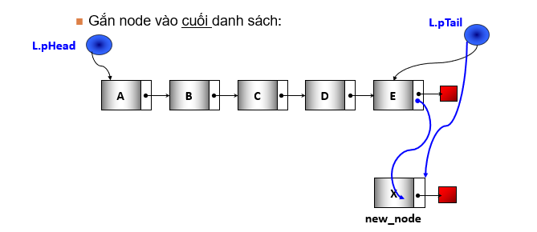](# "Thêm một phần tử vào cuối danh sách")
```cpp
	L.pTail->pNext = new_node;
	L.pTail = new_node;
```


    Thuật toán: Thêm một phần tử vào cuối DS
    	// input: danh sách, phần tử mới new_node
    	// output: danh sách với new_node ở cuối DS
    Nếu DS rỗng thì
    	L.pHead = L.pTail = new_node;
    Ngược lại
    	L.pTail->pNext = new_node ;
    	L.pTail = new_node;
    

Cài đặt: Gắn nút vào cuối DS
```cpp
void addTail(List &L, Node *new_node) {
	if (L.pHead == NULL)
	{
		L.pHead = L.pTail = new_node;
	}
	else
	{
		L.pTail->pNext = new_node;
		L.pTail = new_node ;
	}
}

```

Thêm một thành phần dữ liệu vào cuối danh sách( Dữ liệu -> Node -> Thêm vào danh sách)
```cpp
void InsertLast(LIST &L, datatype x) {
	NODE* new_node = GetNode(x);
	if (new_node == NULL)
		return;
	addTail(L, new_node);
}
```

    Thuật toán: Thêm một thành phần dữ liệu vào cuối ds	
    	// input: danh sách thành phần dữ liệu X
    	// output: danh sách với phần tử chứa X ở cuối DS
    Nhập dữ liệu cho X  (???)
    Tạo nút mới chứa dữ liệu X (???)
    Nếu tạo được:
    Gắn nút mới vào cuối danh sách (???)

Ví dụ: Thêm một số nguyên vào cuối ds:
```cpp
// Nhập dữ liệu cho X
	int x;
	cout<<"Nhập X="; 	cin>>x;
	// Tạo nút mới
	Node* p = GetNode(x);
	// Gắn nút vào cuối DS
	if (p != NULL)	addTail(L, p);
```

Thêm một phần tử
** 3. Chèn vào sau nút q trong danh sách: **
**Chú ý trường hợp danh sách ban đầu rỗng**
Thêm một phần tử
Nếu danh sách ban đầu **rỗng**

[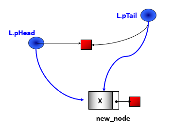](# "Thêm phần tử sau nút Q")

```cpp
	L.pHead = L.pTail = new_node;
```
Chèn một phần tử sau q
[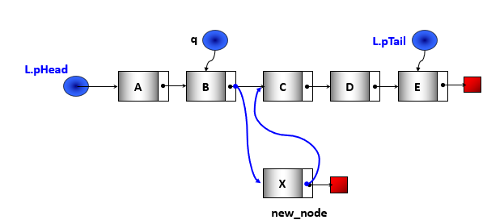](# "Chèn một phần tử sau Q")
```cpp
new_node->pNext = q->pNext;
q->pNext = new_node;

//Nếu q->pNext == NULL thì
	L.pTail = new_node
```
    Thuật toán: Chèn một phần tử sau q
    	// input: danh sách l, q, phần tử mới new_node
    	// output: danh sách với new_node ở sau q
    Nếu  (q != NULL) thì:
    new_node -> pNext = q -> pNext;
    q -> pNext = new_node ;
    Nếu  ( q == L.pTail) thì
    L.pTail = new_node;
    Ngược lại
    	Thêm new_node vào đầu danh sách
    

Cài đặt: Chèn một phần tử sau q
```cpp
void addAfter (List &L, Node *q, Node* new_node) {
	if (q!=NULL)
	{
		new_node->pNext = q->pNext;
		q->pNext = new_node;
		if(q == L.pTail)  	L.pTail = new_node;
	}
}
```
Thêm một thành phần dữ liệu vào cuối
```cpp
NODE* InsertAfter(LIST &L, NODE *q, data x) {
		NODE* p = GetNode(x);
		AddAfter(L, q, p);
}
```


    Thuật toán: Thêm một thành phần dữ liệu vào sau q	
    	// input: danh sách thành phần dữ liệu X
    	// output: danh sách với phần tử chứa X ở cuối DS
    Nhập dữ liệu cho nút q  (???)
    Tìm nút q (???)
    Nếu tồn tại q trong ds thì:
    Nhập dữ liệu cho X  (???)
    Tạo nút mới chứa dữ liệu X (???)
    Nếu tạo được:
    Gắn nút mới vào sau nút q   (???)
    Ngược lại thì báo lỗi
	
**Duyệt danh sách**
Là thao tác thường được thực hiện khi có nhu cầu xử lý các phần tử của danh sách theo cùng một cách thức hoặc khi cần lấy thông tin tổng hợp từ các phần tử của danh sách như:
Đếm các phần tử của danh sách
Tìm tất cả các phần tử thoả điều kiện
Hủy toàn bộ danh sách (và giải phóng bộ nhớ)
…

    Duyệt danh sách
    Bước 1: p = pHead;   //Cho p trỏ đến  phần tử đầu danh sách
    Bước 2: Trong khi  (Danh sách chưa hết)  thực hiện:
    B2.1 :   Xử lý phần tử  p
    B2.2 :   p = p->pNext;	// Cho p trỏ tới phần tử kế 
    
```cpp
void processList (List L) {
     	Node *p = L.pHead;
     	while (p!= NULL) {
			// xử lý cụ thể p tùy ứng dụng
     		p = p->pNext;
     	}
}
```
Ví dụ: In các phần tử trong danh sách
```cpp
void Output (List L) {
	Node* p = L.pHead;
	while (p!=NULL)
	{
		cout<<p->data<<“\t”;
		p = p ->pNext;
	}
	cout<<endl;
}
```
DSLK – Minh họa in danh sách
[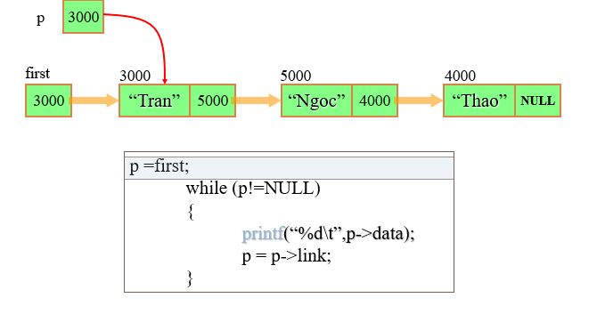](# "Minh hoạ in danh sách")

Tìm kiếm một phần tử có khóa x
```cpp
Node* Search (List  L, int  x) {
	Node* p = L.pHead;
	while (p!=NULL) {
		if (p->data == x)		return p;
		p = p->pNext;
	}
	return NULL; 
}
```

Xóa một node của danh sách
- Xóa node đầu của danh sách
- Xóa node sau node q trong danh sách
- Xóa node có khoá k

    **Xóa node đầu của danh sách**
    Gọi p là node đầu của danh sách (L.pHead)
    Cho pHead trỏ vào node sau node p (là p->pNext)
    Nếu danh sách trở thành rỗng thì L.pTail = NULL
    Giải phóng vùng nhớ mà p trỏ tới

[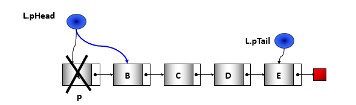](# "Xoá Node đầu danh sách")
```cpp
Node* p = L.pHead;
L.pHead = p->pNext;
if (L.pHead == NULL)  L.pTail = NULL //Nếu danh sách chỉ có 1 node
delete p;
```
Cài đặt
```cpp
int removeHead (List &L) {
	if (L.pHead == NULL) return 0;
	Node* p = L.pHead;
	L.pHead = p->pNext;
	if (L.pHead == NULL)  L.pTail = NULL; //Nếu danh sách sau khi xóa là rỗng
	delete p;
	return 1;
}
```
    Xóa node sau node q trong danh sách
    Điều kiện để có thể xóa được node sau q là:
    q  phải khác NULL  (q !=NULL)
    Node sau q  phải khác NULL (q->pNext !=NULL)
    Có các thao tác:
    Gọi p là node sau q
    Cho vùng pNext của q trỏ vào node đứng sau p
    Nếu p là phần tử cuối thì pTail trỏ vào q
    Giải phóng vùng nhớ mà p trỏ tới

[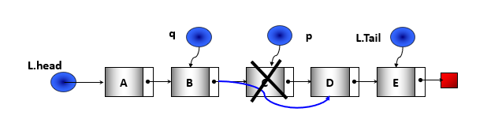](# "Xoá Node Sau Q")
```cpp
Node*   p = q->pNext;
q->pNext = p->pNext;
if  (p == L.pTail)	L.pTail = q; //Nếu node cần xoá là cuối danh sách
delete p;
```
Cài đặt
```cpp
int removeAfter (List &L, Node *q ) {
	if (q !=NULL && q->pNext !=NULL)
	{
		Node*   p = q->pNext;
		q->pNext = p->pNext;
		if  (p == L.pTail)	 L.pTail = q;
		delete p;
		return 1;
	}
	else return 0;
}
```


    Thuật toán: Hủy 1 phần tử có khoá k
    Bước 1:
    Tìm phần tử p có khóa k và phần tử q đứng trước nó 
    Bước 2:
    Nếu  (p== NULL)  thì
    Báo không có k
    Ngược lại 	// tìm thấy k
    P là không phải node đầu danh sách: trường hợp đặc biệt p là node cuối danh sách khi xóa p thì L.pTail thay đổi thế nào?
    P là node đầu danh sách: trường hợp đặc biệt p là node duy nhất của danh sách thì sau khi xóa p thì L.pTail thay đổi thế nào?

Cài đặt: Hủy 1 phần tử có khoá k
```cpp
int removeNode(List & L, int k) {
    Node * p = L.pHead;
    Node * q = NULL;
    while (p != NULL) {
        if (p -> data == k) break;
        q = p;
        p = p -> pNext;
    }
    if (p == NULL) {
        cout << “Không tìm thấy k”;
        return 0;
    } else if (q != NULL) {
        if (p == L.pTail) L.pTail = q;
        q -> pNext = p -> pNext;
        delete p;
    } else //p là phần tử đầu xâu 
    {
        L.pHead = p -> pNext;
        if (L.pHead == NULL) L.pTail = NULL; //ds có 1phần tử
    }
    return 1;
}
```


    Hủy toàn bộ danh sách
    	Để hủy toàn bộ danh sách, thao tác xử lý bao gồm hành động giải phóng một phần tử, do vậy phải cập nhật các liên kết liên quan: 
    	Thuật toán:
    		Bước 1: Trong khi  (Danh sách chưa hết) thực hiện:
    			B1.1:
    				p = L.pHead;
    				L.pHead = L.pHead ->pNext;   // Cho p trỏ tới phần tử kế 
    			B1.2:
    				Hủy p;
    		Bước 2:
    				L.pTail = NULL;	//Bảo đảm tính nhất quán khi xâu rỗng

Hủy toàn bộ danh sách: cài đặt
```cpp
void RemoveList (List &L) {
	Node *p;
	while (L.pHead != NULL) {
		p = L.pHead;
		L.pHead = p->pNext;
	   delete p;
	}
	L.pTail = NULL;
}
```

Đếm số nút trong danh sách:
```cpp
int CountNodes (List L) {
	int count = 0;
	Node *p = L.pHead;
	while (p!=NULL) {
		count++;
		p = p->pNext;
	}
	return count;
}
```

Trích phần tử đầu danh sách
```cpp
Node* PickHead (List &L) {
	Node 	*p = NULL;
	if (L.pHead != NULL) {
		p = L.pHead;
		L.pHead = L.pHead->pNext;
		p->pNext = NULL;
		if (L.pHead == NULL)  L.pTail =  NULL;
	}
	return p;
}
```

# Sắp xếp danh sách
Cách tiếp cận:

- Phương án 1:
	Hoán vị nội dung các phần tử trong danh sách (thao tác trên vùng data). 
- Phương án 2:
	Thay đổi các mối liên kết (thao tác trên vùng link)

Hoán vị nội dung các phần tử trong danh sách
- Cài đặt lại trên danh sách liên kết một trong những thuật toán sắp xếp đã biết trên mảng
- Điểm khác biệt duy nhất là cách thức truy xuất đến các phần tử trên danh sách liên kết thông qua liên kết thay vì chỉ số như trên mảng.
- Do thực hiện hoán vị nội dung của các phần tử nên đòi hỏi sử dụng thêm vùng nhớ trung gian => chỉ thích hợp với các xâu có các phần tử có thành phần data kích thước nhỏ.
- Khi kích thước của trường data lớn, việc hoán vị giá trị của hai phân tử sẽ chiếm chi phí đáng kể.

**Sắp xếp bằng phương pháp đổi chổ trực tiếp( Interchange Sort )**
```cpp
void   SLL_InterChangeSort ( List  &L ) {
	for ( Node* p=L.first ; p!=L.last ; p=p->link )
		for ( Node* q=p->link ; q!=NULL ; q=q->link )
			if ( p->data > q->data )
				Swap( p->data , q->data );
}
```
[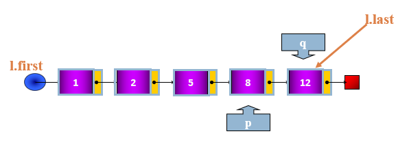](# "Đổi chổ trực tiếp")

**Sắp xếp bằng phương pháp chọn trực tiếp ( Selection sort )**
```cpp
void	ListSelectionSort (LIST &L) {
	for ( Node* p = L.first ; p != L.last ; p = p->link )
 	{
		Node* min = p;
		for ( Node* q = p->link ; q != NULL ; q = q->link )
				if ( min->data > q->data ) min = q ;
				 	Swap(min->data, p->data); 
	}
}
```
[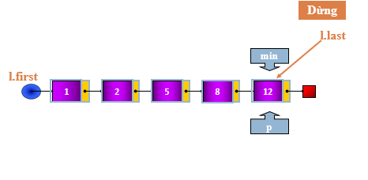](# "Chọn trực tiếp")

**Sắp xếp bằng phương pháp nổi bọt( Bubble sort )**
```cpp
void   SLL_BubleSort (  List   L ) {
	Node*  t = L.last ;
	for ( Node* p = L.first ;  p != NULL ; p = p->link)
	{	Node*  t1;
		 for ( Node*  q=L.first ; p!=t ; q=q->link )
		{
			if( q->data  > q->link->data )
				Swap( q->data , q->link->data );
			t1 = q ;
		}
		t = t1;
	}
}
```
[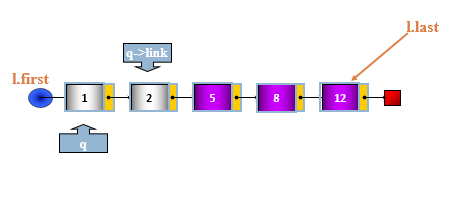](# "Sắp xếp nổi bọt")

**Sắp xếp Thay đổi các mối liên kết **

    Thay vì hoán đổi giá trị, ta sẽ tìm cách thay đổi trình tự móc nối của các phần tử sao cho tạo lập nên được thứ tự mong muốn => chỉ thao tác trên các móc nối (link).
    Kích thước của trường link:
    	Không phụ thuộc vào bản chất dữ liệu lưu trong xâu 
    	Bằng kích thước 1 con trỏ (2 hoặc 4 byte trong môi trường 16 bit, 4 hoặc 8 byte trong môi trường 32 bit…)
    Thao tác trên các móc nối thường phức tạp hơn thao tác trực tiếp trên dữ liệu.
    =>Cần cân nhắc khi chọn cách tiếp cận: Nếu dữ liệu không quá lớn thì nên chọn phương án 1 hoặc một thuật toán hiệu quả nào đó.
    

Phương pháp lấy Node ra khỏi danh sách giữ nguyên địa chỉ của Node
[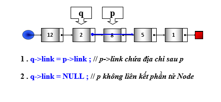](# "Lấy node giữ địa chỉ")

**Quick Sort : Thuật toán**


    //input: xâu (first, last)
    //output: xâu đã được sắp tăng dần
    Bước 1: Nếu xâu có ít hơn 2 phần tử
    		Dừng;	//xâu đã có thứ tự
    Bước 2: Chọn X là phần tử đầu xâu L làm ngưỡng. Trích X ra khỏi L.
    Bước 3: Tách xâu L ra làm 2 xâu L1 (gồm các phần tử nhỏ hơn hay bằng X) và L2 (gồm các phần tử lớn hơn X).
    Bước 4: Sắp xếp Quick Sort (L1).
    Bước 5: Sắp xếp Quick Sort (L2).
    Bước 6: Nối L1, X, và L2 lại theo trình tự ta có xâu L đã được sắp xếp.
    

**Nối 2 danh sách**
```cpp
void	SListAppend(SLIST &l, LIST &l2) {
	if (l2.first == NULL) return;
	if (l.first == NULL)
		l = l2;
	else {
		l.first->link = l2.first;
		l.last = l2.last;
	}
	Init(l2);
}
```
```cpp
void	SListQSort(SLIST &l) {
	NODE *X, *p;
	SLIST l1, l2;
	if (list.first == list.last) return; 
	Init(l1);	Init(l2);
	X = l.first; l.first=x->link;
	while (l.first != NULL) {
		p = l.first;
		if (p->data <= X->data) AddFirst(l1, p);
		else		AddFirst(l2, p);
	}
	SListQSort(l1);	 SListQSort(l2);
	SListAppend(l, l1);	
	AddFirst(l, X);
	SListAppend(l, l2);
}
```

**Quick sort : nhận xét**
Nhận xét:
- Quick sort trên xâu đơn đơn giản hơn phiên bản của nó trên mảng một chiều
- Khi dùng quick sort sắp xếp một xâu đơn, chỉ có một chọn lựa phần tử cầm canh duy nhất hợp lý là phần tử đầu xâu. Chọn bất kỳ phần tử nào khác cũng làm tăng chi phí một cách không cần thiết do cấu trúc tự nhiên của xâu.